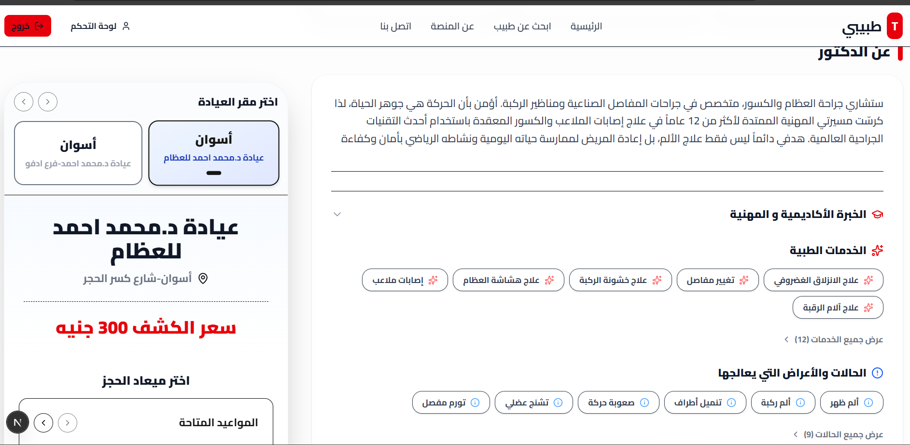
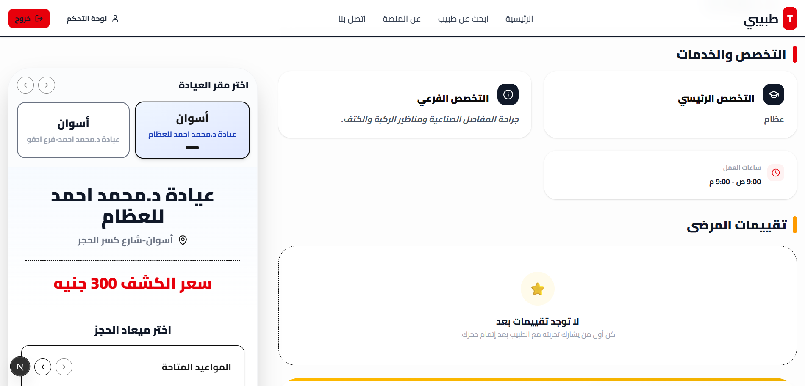
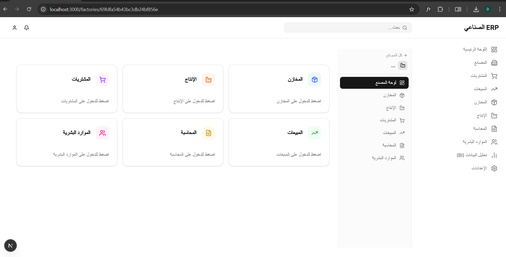
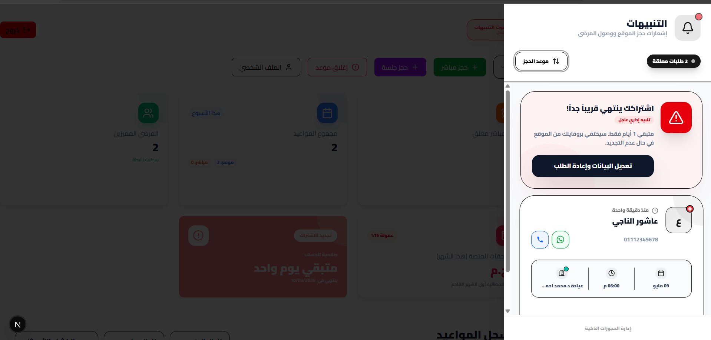
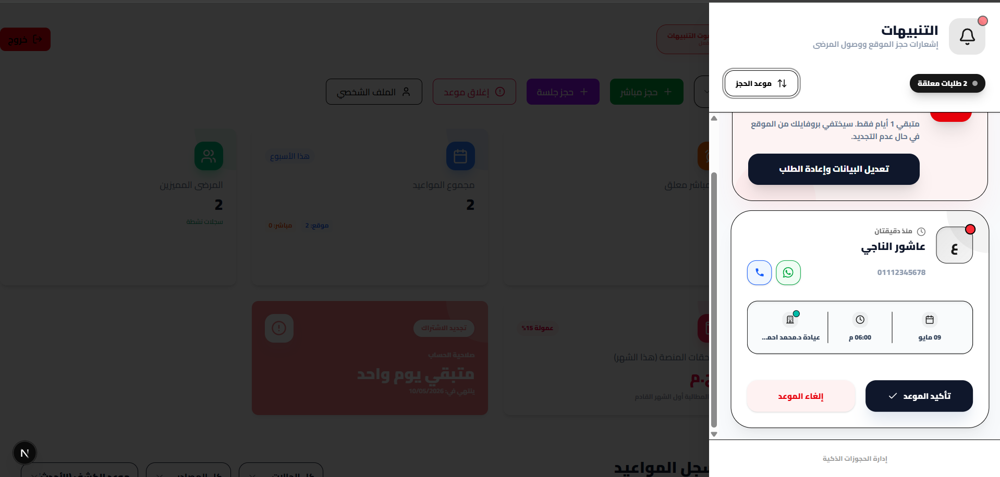
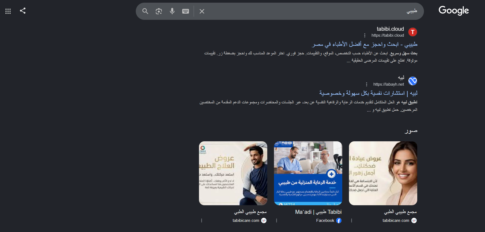
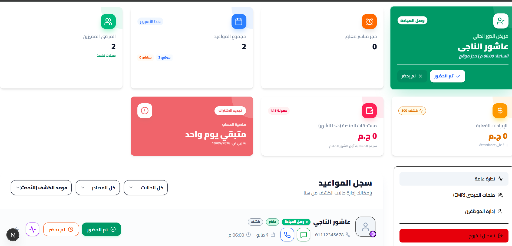
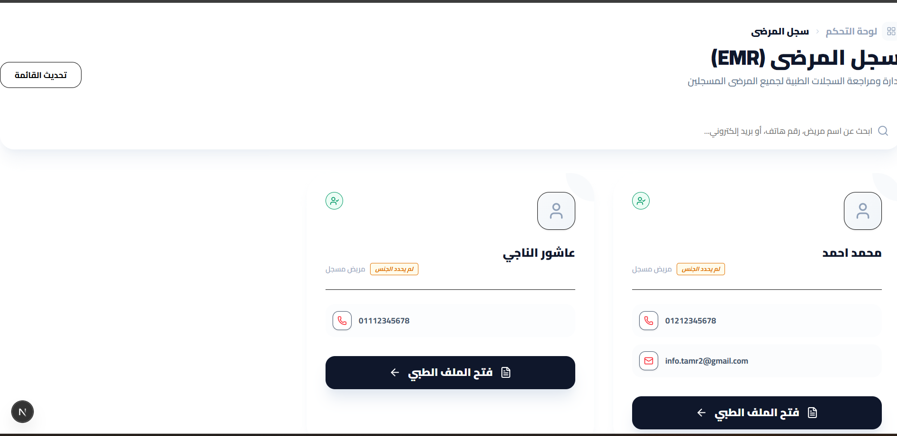
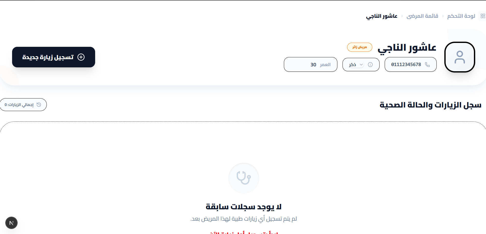
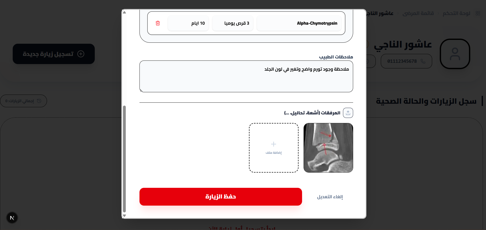

<div align="center">
  
  <h1>Tabibi (طبيبي) - Enterprise Medical Booking SaaS</h1>
  <p>A comprehensive, multi-tenant healthcare platform connecting patients with top-tier doctors and clinics across Egypt.</p>

  [](https://nextjs.org/)
  [](https://nodejs.org/)
  [](https://www.mongodb.com/)
  [](https://tailwindcss.com/)
  [](https://www.typescriptlang.org/)
</div>

---

## 🌟 Overview

**Tabibi** is a production-ready, highly scalable Medical Booking SaaS platform. Designed with a robust **Next.js (App Router)** frontend and a high-performance **Node.js/Express** backend, it streamlines the healthcare experience for three core user types: **Patients, Doctors, and System Administrators.**

The platform supports complex real-world medical workflows, including **multi-branch clinic management**, dynamic scheduling, advanced search filtering, and an integrated EMR (Electronic Medical Records) module.

## 📸 Platform Tour: A Complete SaaS Journey


### 1️⃣ The Patient Experience (Discovery & Booking)
The patient journey is designed for maximum conversion, featuring advanced filtering, dynamic SEO profiles, and an intuitive booking flow.

| 🏠 Landing & Smart Search | 👨‍⚕️ Comprehensive SEO Profiles |
|:---:|:---:|
| <br>*Advanced multi-level filtering by governorate, city, and specialty.* | <br>*SEO-optimized dynamic profiles with full medical taxonomy.* |

| 🏥 Multi-Branch Booking Engine | ⭐ Verified Patient Reviews |
|:---:|:---:|
| <br>*Frictionless guest booking and dynamic schedule rendering per clinic branch.* | <br>*Authentic review system only available to patients who attended their sessions.* |

### 2️⃣ The Tenant Experience: Onboarding & Configuration
Doctors are equipped with a powerful setup wizard to configure their digital presence and clinic operations.

| 📝 Comprehensive Medical Profiling | 🏷️ Advanced Taxonomy Engine |
|:---:|:---:|
| <br>*Capturing exact scientific titles, specialties, and experience.* | <br>*Tag-based selection for services and treated symptoms.* |

| 📍 Multi-Location & Geodata Setup | 📅 Dynamic Scheduling Engine |
|:---:|:---:|
| <br>*Doctors can pinpoint their exact clinic location on the interactive map.* | <br>*Configuring complex weekly schedules, session durations, and fees.* |

| 🏢 Branch Management | 🚀 Automated SEO Generator |
|:---:|:---:|
| <br>*Easily add new branches and copy schedules with one click.* | <br>*Auto-generated Arabic marketing copy to boost Google indexing.* |

### 3️⃣ The Tenant Experience: Clinic Operations (CMS)
A robust control center for daily clinic operations, financial tracking, and real-time alerts.

| 📊 Dashboard & Financials | 🔔 Actionable Notification Center |
|:---:|:---:|
| <br>*Tenant overview with subscription status, revenue, and platform commissions.* | <br>*Real-time alerts with one-click actions for bookings and subscription enforcements.* |

### 4️⃣ The Tenant Experience: Medical & Staff Management (EMR & RBAC)
Advanced enterprise features for delegating work and securely managing patient health records.

| 👥 Staff Management (RBAC) | 📇 Unified Patient Directory |
|:---:|:---:|
| <br>*Delegating branch access to assistants with granular permissions.* | <br>*Centralized directory of all patients with quick access to their medical files.* |

| 📝 Clinical Documentation | 🗂️ Electronic Medical Records (EMR) |
|:---:|:---:|
| <br>*Recording new diagnoses, symptoms, and generating electronic prescriptions.* | <br>*Comprehensive patient history and medical imaging (X-ray/Scan) uploads.* |

### 5️⃣ The Admin Experience (Superuser)
Platform owners have complete oversight over tenants and platform revenue.

| 📈 Platform Analytics | 🛡️ Onboarding Approvals |
|:---:|:---:|
| <br>*Platform-wide analytics, revenue tracking, and user management.* | <br>*Strict verification workflow for new doctor registrations.* |

---

## 🚀 Enterprise Features

### 👨‍⚕️ For Doctors & Clinics
* **Real-time Queue Management:** Live tracking of patient arrivals ("وصل العيادة"), managing walk-ins, and handling direct session bookings from the clinic reception.
* **Auto-SEO Marketing Profiles:** Dynamically generated, SEO-optimized Arabic marketing copy for each doctor based on their specialties, subspecialties, and locations to boost Google rankings.
* **Multi-Branch Architecture:** Manage schedules, pricing, and locations for an unlimited number of clinic branches from a single unified dashboard.
* **Role-Based Staff Access (RBAC):** Delegate operations to assistants/receptionists, granting them specific permissions for distinct clinic branches.
* **Electronic Medical Records (EMR):** Record patient diagnoses, prescribe medications (e-prescriptions), write clinical notes, and securely store medical imaging (X-rays/Scans).
* **Actionable Notification Center:** Real-time push notifications for new bookings, allowing instant confirmation/cancellation and direct WhatsApp messaging right from the alert drawer.
* **Automated Subscription Enforcements:** System-level warnings for impending subscription expiry with automated profile unlisting if not renewed.
* **Interactive Map Integration:** Pinpoint clinic locations natively for patients.

### 🤒 For Patients
* **Frictionless Booking:** Guest booking support or seamless account creation.
* **Intelligent Search:** Filter doctors by precise geographic locations (Governorate/City), medical specialty, pricing tiers, and available days.
* **Verified Reviews:** Leave feedback only after successfully attending an appointment, ensuring platform trust.

### 🛡️ For Platform Administrators
* **Real-time Analytics:** Track daily bookings, revenue, and active users.
* **Onboarding Workflow:** Review and approve/reject new doctor registrations to maintain quality control.
* **Financial Management:** Configure and track platform commission rates natively.

---

## 💻 Tech Stack & Architecture

### **Frontend (Client)**
* **Framework:** Next.js 16 (React 18) utilizing the App Router for optimal Server-Side Rendering (SSR).
* **Styling:** Tailwind CSS (fully customized for deep RTL Arabic support).
* **State Management:** React Hooks & Context API.
* **Forms & Validation:** Controlled components with strict typing.
* **SEO:** Dynamic OpenGraph tags and JSON-LD schema generation for rich Google Search results.

### **Backend (Server)**
* **Runtime & Framework:** Node.js + Express.js.
* **Database:** MongoDB via Mongoose ODM (complex relational population and indexing).
* **Authentication:** Stateless JWT (JSON Web Tokens) with secure HTTP headers.
* **Security:** bcryptjs for hashing, Helmet for header security, CORS configuration.

---

## ⚙️ Local Development Setup

To run this project locally, you will need **Node.js (v18+)** and a **MongoDB** instance.

### 1. Clone the repository
```bash
git clone https://github.com/yourusername/tabibi-saas.git
cd tabibi-saas
```

### 2. Backend Setup
```bash
cd server
npm install

# Create a .env file based on .env.example
echo "PORT=5000" > .env
echo "MONGO_URI=mongodb://localhost:27017/tabibi" >> .env
echo "JWT_SECRET=your_super_secret_jwt_key_here" >> .env

# Start the backend server
npm run dev
```

### 3. Frontend Setup
```bash
cd ../client
npm install

# Create a .env.local file
echo "NEXT_PUBLIC_API_URL=http://localhost:5000/api" > .env.local

# Start the Next.js development server
npm run dev
```

The application will be available at `http://localhost:3000`.

---

## 🏗️ System Architecture

The database is designed to handle complex relationships between users, doctors, and multi-location clinics.

- `User`: Handles authentication, roles (Admin, Doctor, Patient), and basic contact info.
- `Doctor`: Extends user data with professional details, specialties, pricing, and an array of `Clinic` references.
- `Clinic`: Represents physical locations with geodata and specific schedules.
- `Appointment`: Links a Patient (or Guest), a Doctor, and a specific Clinic branch at a given timeslot.
- `Review`: Verified feedback linked to completed appointments.

---

<div align="center">
  <p>Built with ❤️ for modern healthcare.</p>
</div>
