<div align="center">
  
  <h1>Tabibi (طبيبي) - Enterprise Medical Booking SaaS</h1>
  <p>A comprehensive, multi-tenant healthcare platform connecting patients with top-tier doctors and clinics across Egypt.</p>

  [](https://nextjs.org/)
  [](https://nodejs.org/)
  [](https://www.mongodb.com/)
  [](https://tailwindcss.com/)
  [](https://www.typescriptlang.org/)
</div>

---

## 🌟 Overview

**Tabibi** is a production-ready, highly scalable Medical Booking SaaS platform. Designed with a robust **Next.js (App Router)** frontend and a high-performance **Node.js/Express** backend, it streamlines the healthcare experience for three core user types: **Patients, Doctors, and System Administrators.**

The platform supports complex real-world medical workflows, including **multi-branch clinic management**, dynamic scheduling, advanced search filtering, and an integrated EMR (Electronic Medical Records) module.

## 📸 Platform Tour: A Complete SaaS Journey

Experience the complete lifecycle of **Tabibi**, starting from patient discovery all the way to advanced clinical operations and enterprise EMR management. 

### 1️⃣ Patient Discovery & Seamless Booking
The journey begins with the patient. The platform offers a frictionless search and booking experience designed to maximize conversion rates.

| 🏠 Landing & Smart Search | 📍 Location & Area Selection |
|:---:|:---:|
| 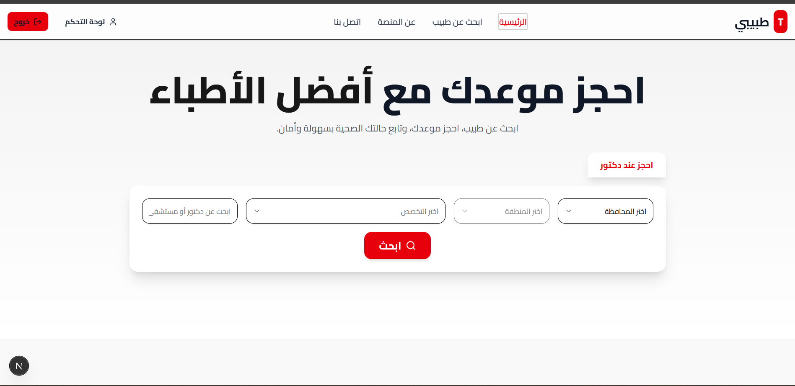<br>*Public landing page featuring a powerful doctor search engine.* | 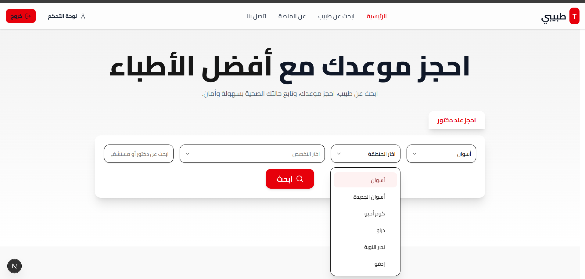<br>*Advanced filtering by governorate, city, and local areas.* |

| 🩺 Specialty Selection | 🔍 Dynamic Search Results |
|:---:|:---:|
| 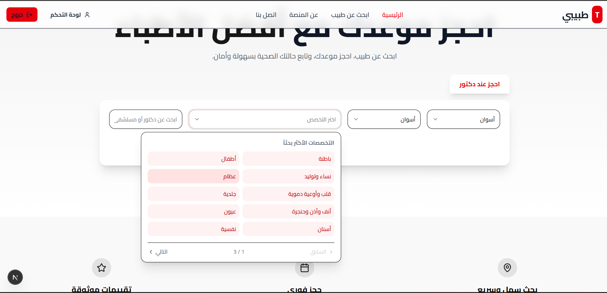<br>*Granular selection of medical specialties and sub-specialties.* | 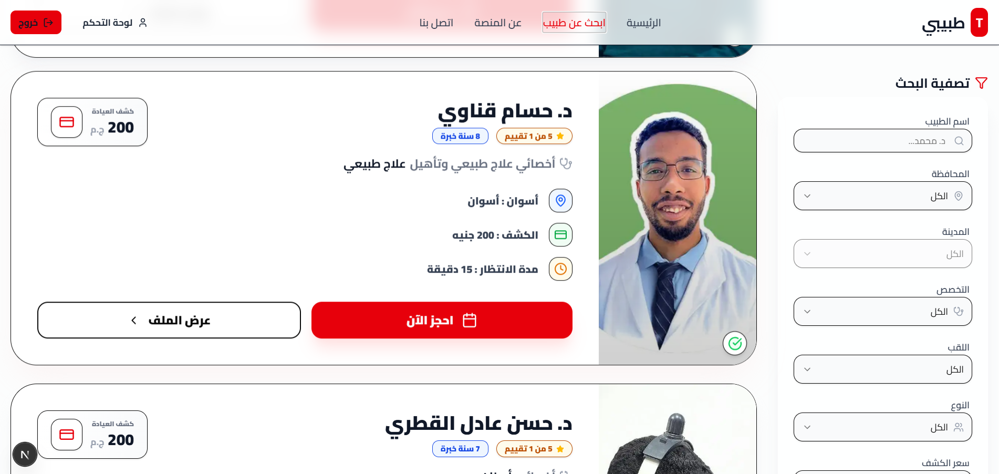<br>*Dynamic search results with a comprehensive filtering sidebar.* |

| 👨‍⚕️ Comprehensive SEO Profiles | 📅 Interactive Scheduling |
|:---:|:---:|
| <br>*SEO-optimized dynamic public profiles showcasing the doctor's brand.* | 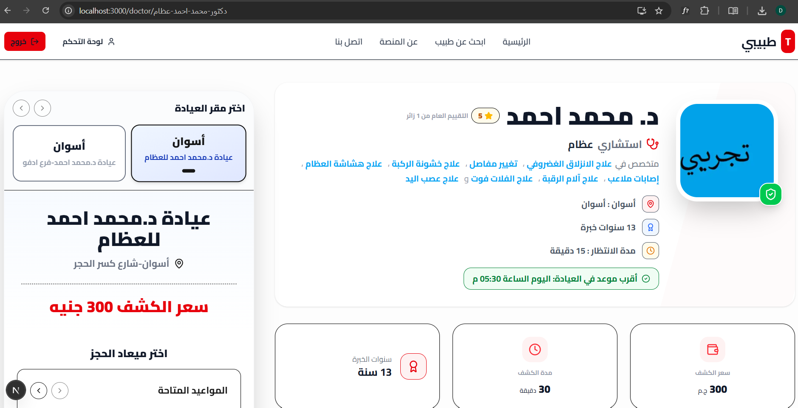<br>*Interactive calendar for selecting consultation dates and fees.* |

| 🎓 Professional Background | 🏷️ Medical Taxonomy |
|:---:|:---:|
| <br>*Detailed view of the doctor's professional experience and education.* | 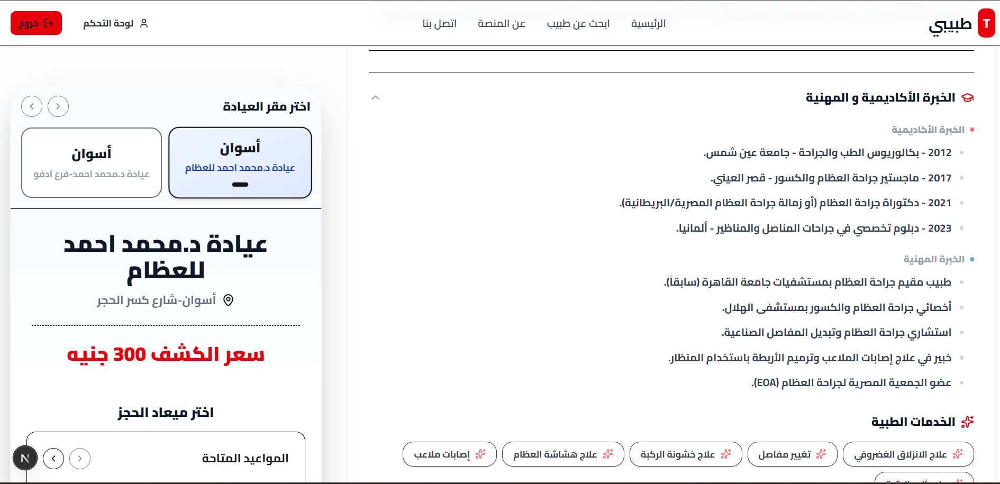<br>*List of specific medical services and treated symptoms.* |

| ⭐ Verified Patient Reviews | 📖 Doctor Biography |
|:---:|:---:|
| <br>*Authentic review system restricted to verified patients.* | 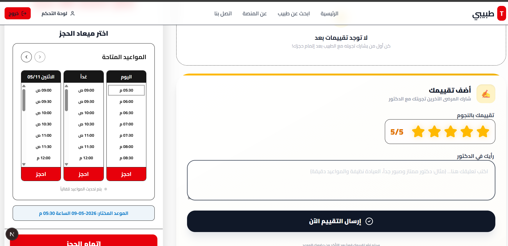<br>*Detailed doctor biography and professional summary.* |

| 📝 Frictionless Guest Booking | 🛡️ Booking Verification |
|:---:|:---:|
| 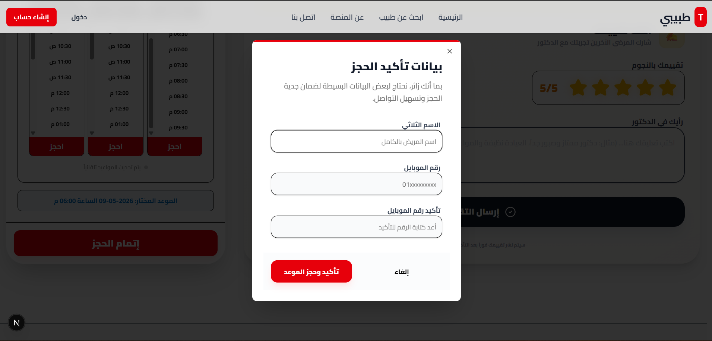<br>*Guest booking modal capturing essential patient contact details.* | 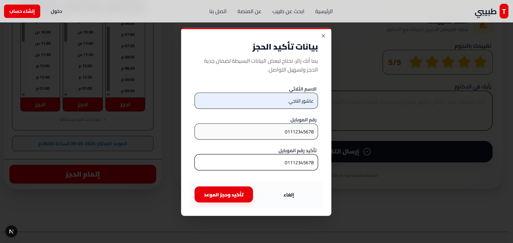<br>*Seamless appointment verification step.* |

| ✅ Booking Confirmation |
|:---:|
| 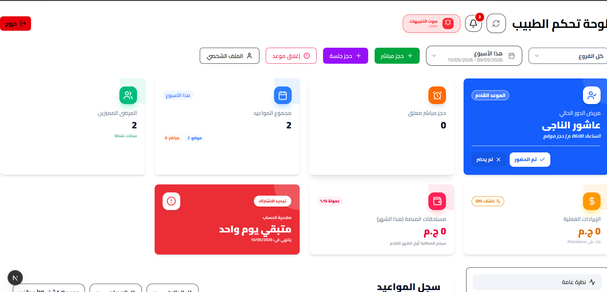<br>*Successful appointment confirmation generating a unique booking ID.* |

### 2️⃣ Tenant Dashboard & Real-Time Operations
Doctors are equipped with a robust control center to manage their daily clinic operations, track financials, and receive real-time alerts.

| 🔔 Actionable Notification Center | 🗂️ Expanded Navigation |
|:---:|:---:|
| <br>*Real-time alerts for new bookings with one-click actions.* | <br>*Expanded sidebar providing access to all tenant modules.* |

| 📊 Reservation Analytics | 📅 Upcoming Visits Queue |
|:---:|:---:|
| 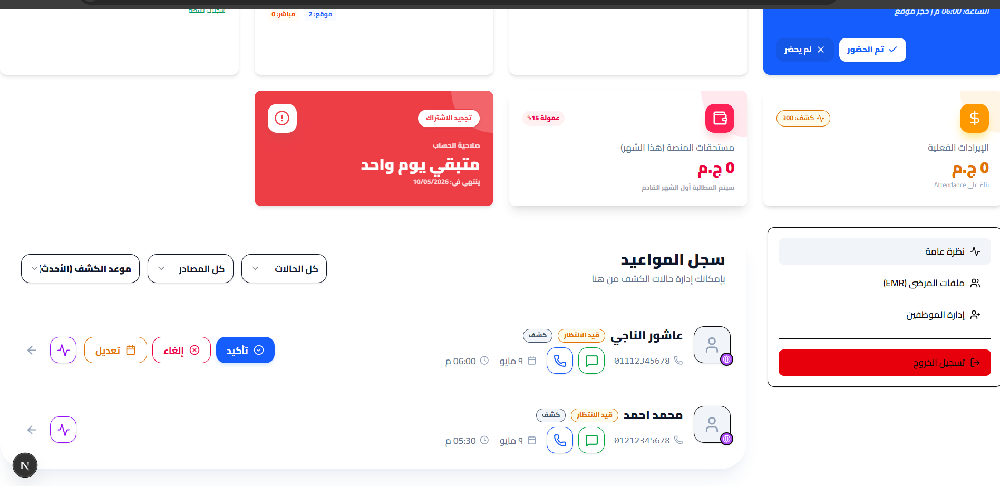<br>*Dashboard overview of today's reservations and revenue.* | 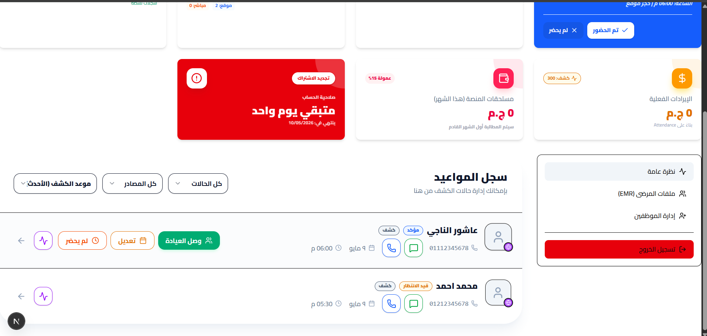<br>*Real-time queue management for upcoming patient visits.* |

| 📈 Performance Statistics |
|:---:|
| <br>*Statistical summary of clinic performance and platform commissions.* |

### 3️⃣ Electronic Medical Records (EMR) & Clinical Workflows
A fully integrated EMR system allowing doctors to securely manage patient health records, document visits, and issue digital prescriptions.

| 📇 Unified Patient Directory | 🗂️ EMR Initial State |
|:---:|:---:|
| <br>*Centralized management of all registered clinic patients.* | <br>*The Electronic Medical Record interface ready for documentation.* |

| 🩺 Clinical Documentation | 💊 Digital Prescriptions |
|:---:|:---:|
| 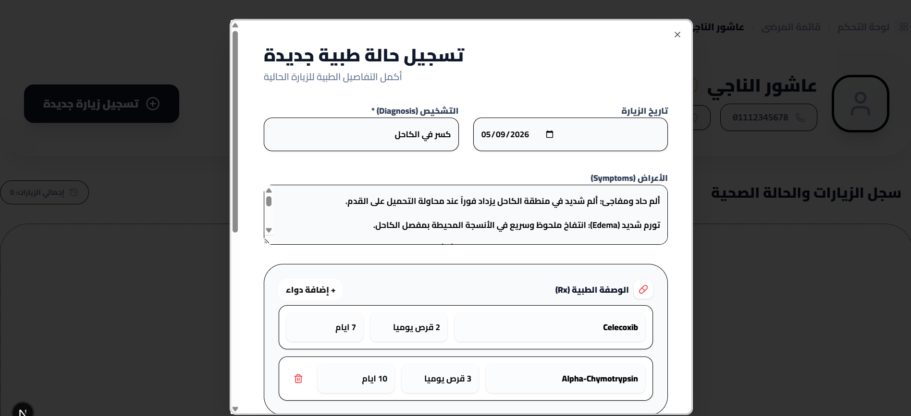<br>*Recording new diagnoses, symptoms, and medical examination details.* | <br>*Digital e-prescription interface with advanced medication search.* |

| 📋 Medical Visit Summary |
|:---:|
| 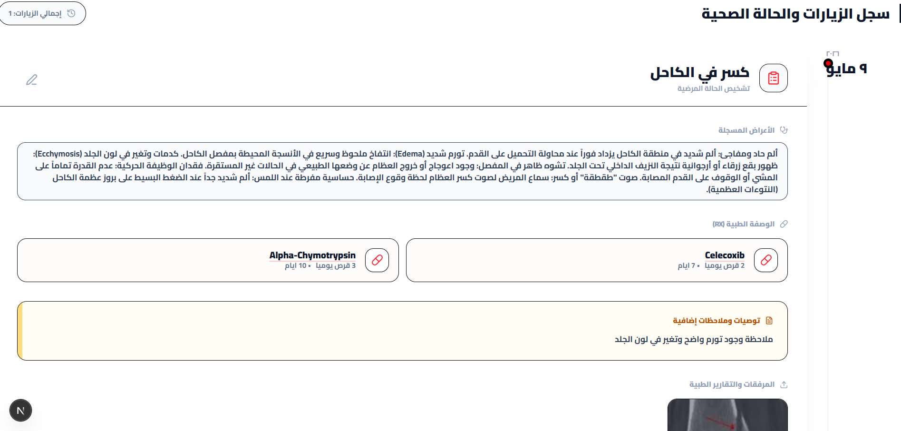<br>*Comprehensive visit summary including patient history and attached files.* |

### 4️⃣ Clinic Administration & RBAC
Enterprise features for delegating work to clinic staff with strict Role-Based Access Control.

| 👥 Staff Management (RBAC) | ➕ Adding New Staff |
|:---:|:---:|
| 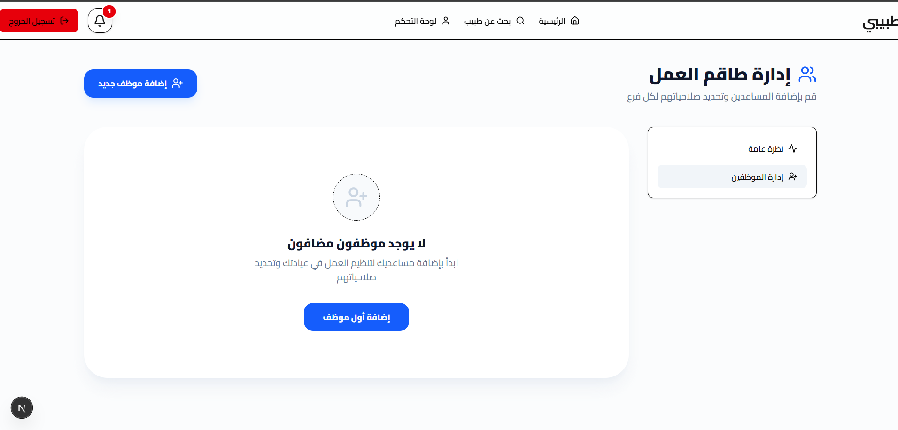<br>*Delegating access to assistants with granular branch permissions.* | 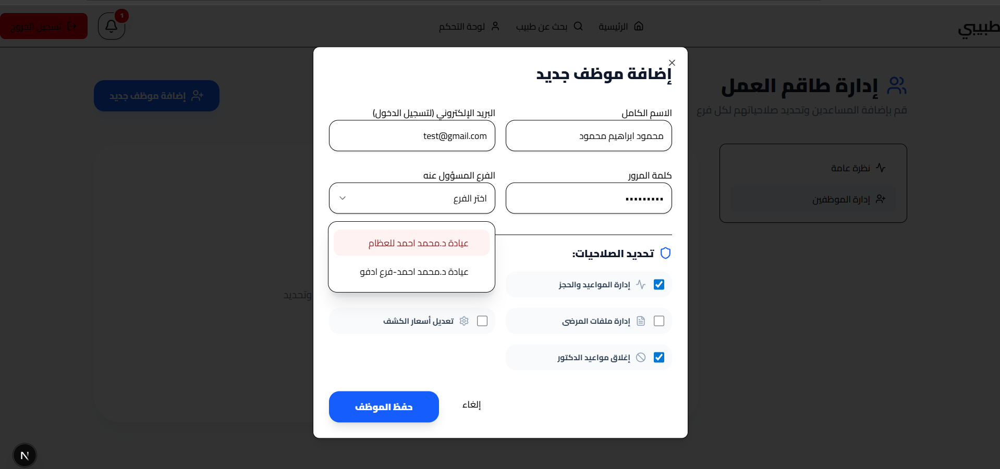<br>*Modal interface for onboarding new clinic staff members.* |

| 💳 Subscription Management |
|:---:|
| 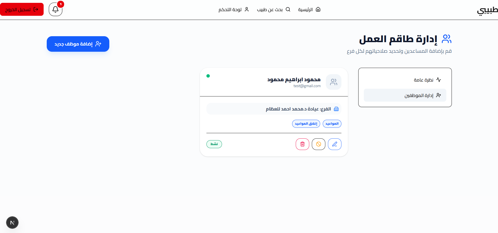<br>*Tenant subscription plans and billing configuration.* |

### 5️⃣ Tenant Setup & Configuration Wizard
A powerful setup wizard for doctors to configure their digital presence, branches, and schedules.

| 📝 Personal Details Setup | 🎓 Professional Titles |
|:---:|:---:|
| 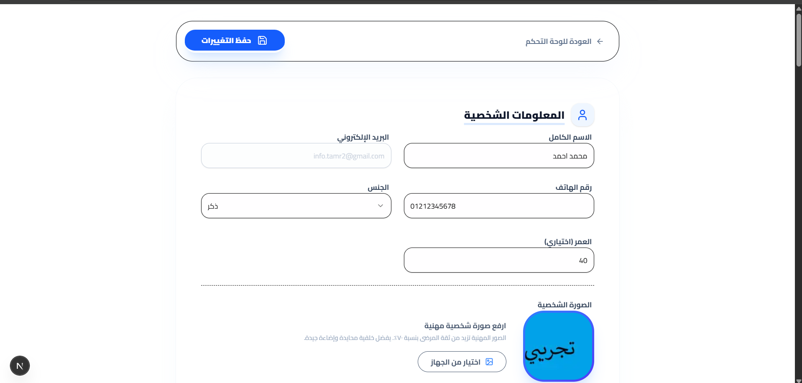<br>*Capturing personal details and contact information.* | 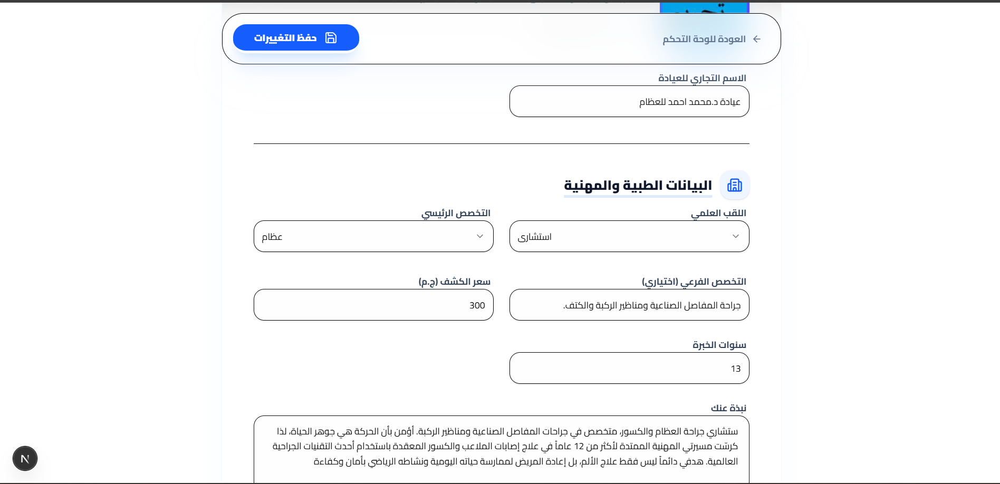<br>*Configuring exact scientific titles and degrees.* |

| 🏷️ Symptoms & Taxonomy | 🚀 Auto-SEO Generator |
|:---:|:---:|
| 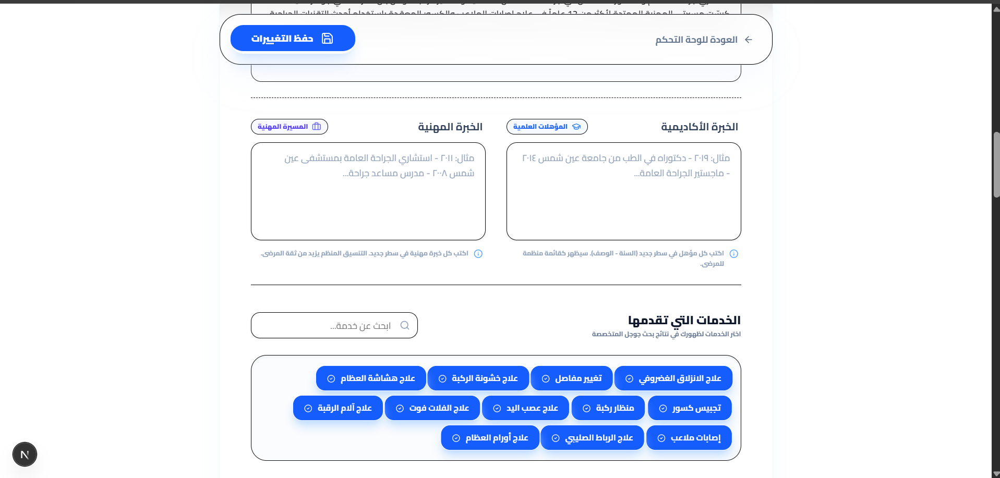<br>*Tag-based selection for treating symptoms and diseases.* | 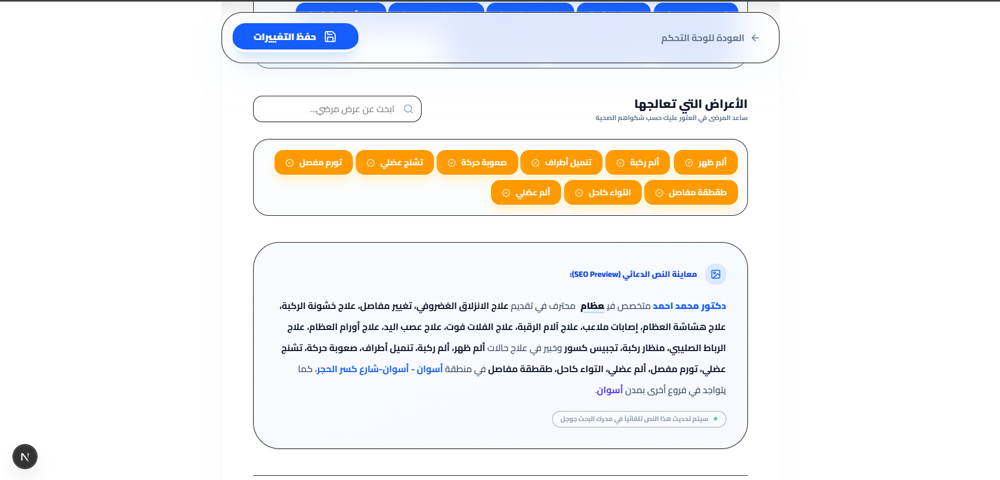<br>*Auto-generated Arabic marketing copy to boost Google indexing.* |

| 📍 Multi-Location Map Setup | 🏢 Branch Management |
|:---:|:---:|
| 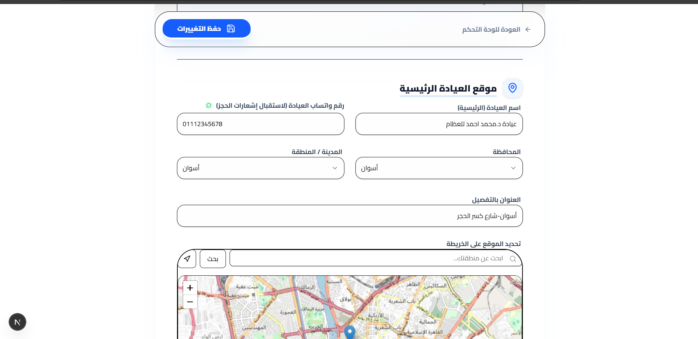<br>*Doctors can pinpoint their exact clinic location on an interactive map.* | 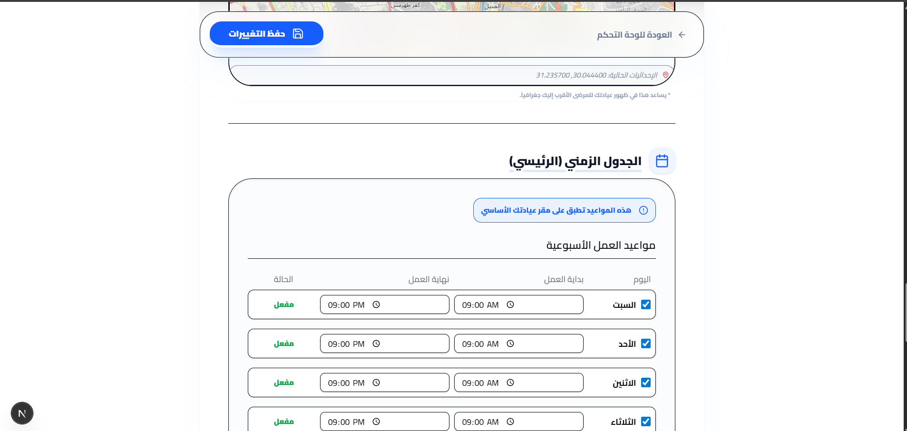<br>*Multi-branch management interface for expanding clinic presence.* |

| 💰 Services & Fees | 📅 Weekly Schedule Engine |
|:---:|:---:|
| 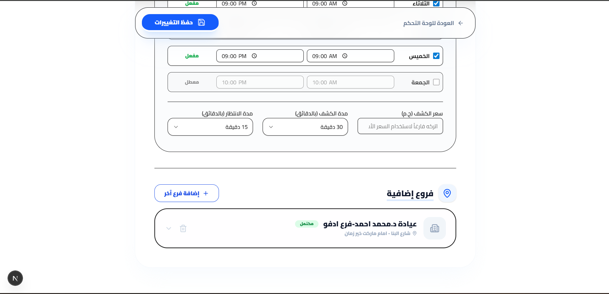<br>*Configuration of medical services and specific consultation fees.* | 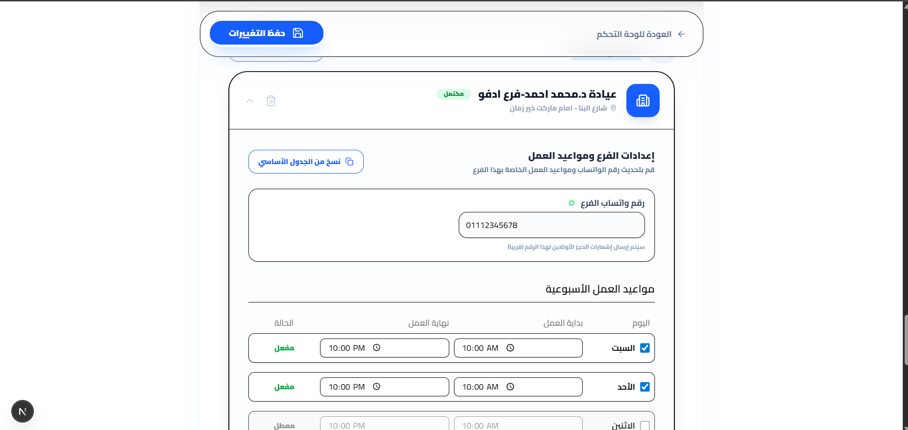<br>*Weekly working schedule management.* |

| ⏱️ Dynamic Time Slots |
|:---:|
| 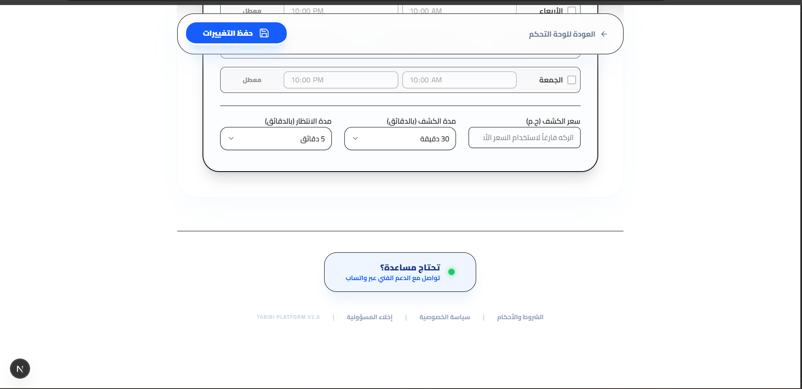<br>*Detailed time slot and shift configuration engine.* |

### 6️⃣ Mobile-First Experience
The platform is fully responsive, ensuring a seamless experience for both patients on-the-go and doctors managing their clinics from their phones.

| 📱 Mobile Search Interface | 🩺 Mobile Patient Queue |
|:---:|:---:|
| 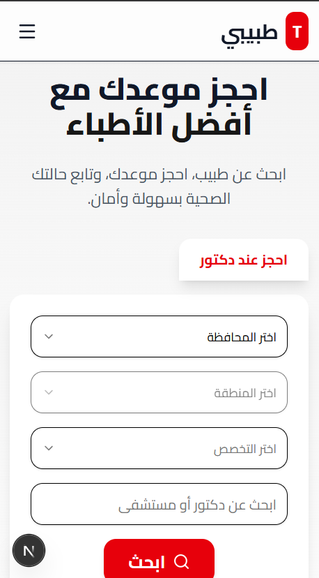<br>*Mobile-optimized landing page with primary search.* | 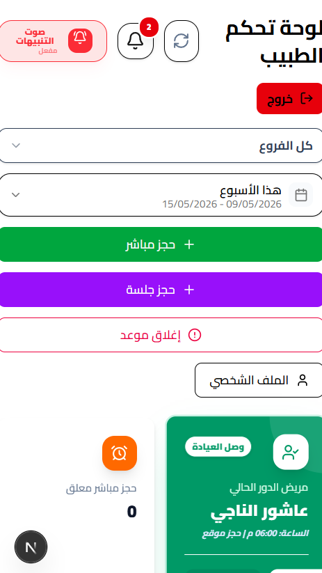<br>*Mobile doctor dashboard for tracking the current patient queue.* |

| ⚙️ Mobile Profile Setup |
|:---:|
| 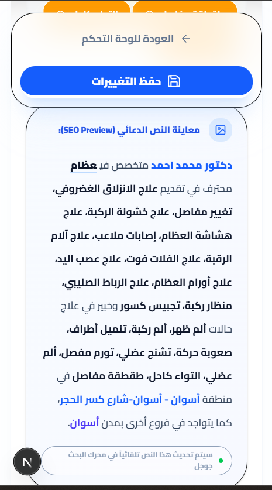<br>*Mobile-responsive profile setup and SEO preview.* |

---

## 🚀 Enterprise Features

### 👨‍⚕️ For Doctors & Clinics
* **Real-time Queue Management:** Live tracking of patient arrivals ("وصل العيادة"), managing walk-ins, and handling direct session bookings from the clinic reception.
* **Auto-SEO Marketing Profiles:** Dynamically generated, SEO-optimized Arabic marketing copy for each doctor based on their specialties, subspecialties, and locations to boost Google rankings.
* **Multi-Branch Architecture:** Manage schedules, pricing, and locations for an unlimited number of clinic branches from a single unified dashboard.
* **Role-Based Staff Access (RBAC):** Delegate operations to assistants/receptionists, granting them specific permissions for distinct clinic branches.
* **Electronic Medical Records (EMR):** Record patient diagnoses, prescribe medications (e-prescriptions), write clinical notes, and securely store medical imaging (X-rays/Scans).
* **Actionable Notification Center:** Real-time push notifications for new bookings, allowing instant confirmation/cancellation and direct WhatsApp messaging right from the alert drawer.
* **Automated Subscription Enforcements:** System-level warnings for impending subscription expiry with automated profile unlisting if not renewed.
* **Interactive Map Integration:** Pinpoint clinic locations natively for patients.

### 🤒 For Patients
* **Frictionless Booking:** Guest booking support or seamless account creation.
* **Intelligent Search:** Filter doctors by precise geographic locations (Governorate/City), medical specialty, pricing tiers, and available days.
* **Verified Reviews:** Leave feedback only after successfully attending an appointment, ensuring platform trust.

### 🛡️ For Platform Administrators
* **Real-time Analytics:** Track daily bookings, revenue, and active users.
* **Onboarding Workflow:** Review and approve/reject new doctor registrations to maintain quality control.
* **Financial Management:** Configure and track platform commission rates natively.

---

## 💻 Tech Stack & Architecture

### **Frontend (Client)**
* **Framework:** Next.js 16 (React 18) utilizing the App Router for optimal Server-Side Rendering (SSR).
* **Styling:** Tailwind CSS (fully customized for deep RTL Arabic support).
* **State Management:** React Hooks & Context API.
* **Forms & Validation:** Controlled components with strict typing.
* **SEO:** Dynamic OpenGraph tags and JSON-LD schema generation for rich Google Search results.

### **Backend (Server)**
* **Runtime & Framework:** Node.js + Express.js.
* **Database:** MongoDB via Mongoose ODM (complex relational population and indexing).
* **Authentication:** Stateless JWT (JSON Web Tokens) with secure HTTP headers.
* **Security:** bcryptjs for hashing, Helmet for header security, CORS configuration.

---

## ⚙️ Local Development Setup

To run this project locally, you will need **Node.js (v18+)** and a **MongoDB** instance.

### 1. Clone the repository
```bash
git clone https://github.com/yourusername/tabibi-saas.git
cd tabibi-saas
```

### 2. Backend Setup
```bash
cd server
npm install

# Create a .env file based on .env.example
echo "PORT=5000" > .env
echo "MONGO_URI=mongodb://localhost:27017/tabibi" >> .env
echo "JWT_SECRET=your_super_secret_jwt_key_here" >> .env

# Start the backend server
npm run dev
```

### 3. Frontend Setup
```bash
cd ../client
npm install

# Create a .env.local file
echo "NEXT_PUBLIC_API_URL=http://localhost:5000/api" > .env.local

# Start the Next.js development server
npm run dev
```

The application will be available at `http://localhost:3000`.

---

## 🏗️ System Architecture

The database is designed to handle complex relationships between users, doctors, and multi-location clinics.

- `User`: Handles authentication, roles (Admin, Doctor, Patient), and basic contact info.
- `Doctor`: Extends user data with professional details, specialties, pricing, and an array of `Clinic` references.
- `Clinic`: Represents physical locations with geodata and specific schedules.
- `Appointment`: Links a Patient (or Guest), a Doctor, and a specific Clinic branch at a given timeslot.
- `Review`: Verified feedback linked to completed appointments.

---

<div align="center">
  <p>Built with ❤️ for modern healthcare.</p>
</div>
